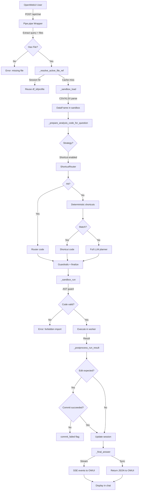
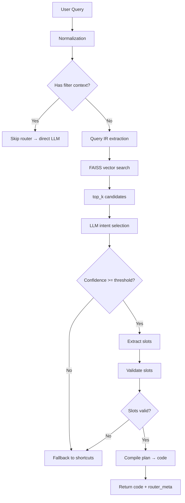
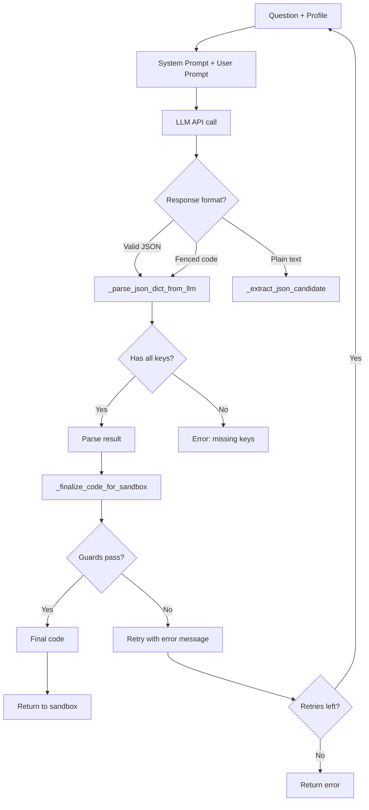
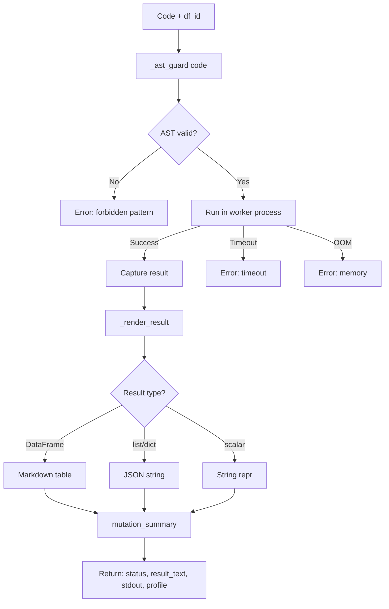

# Excel Chat - Детальна документація потоку даних

## 1. Огляд

**Excel Chat** — це система аналізу табличних даних (CSV/XLSX), яка інтегрується з OpenWebUI для обробки природних запитів користувачів. Система дозволяє запитувати дані українською мовою (наприклад, "Скільки рядків у таблиці?", "Покажи топ 10 найдорожчих товарів в наявності") і отримувати відповіді у вигляді агрегованих значень, таблиць або змінених даних.

**Основні можливості:**
- Нативна обробка CSV/XLSX файлів через OpenWebUI
- Інтелектуальний роутинг через shortcuts (шаблонні запити) з FAISS векторним пошуком
- LLM-генерація коду для складних запитів
- Безпечне виконання у sandbox-середовищі з AST-гейтеймінгом
- Детерміновані форматування результатів (агрегати, таблиці,Availability checks)
- Система навчання (learning) для автоматичного підвищення успішних запитів до shortcuts
- Відстеження виконання (route tracing) з редагуванням секретів

**Runtime контекст:**
- OpenWebUI як frontend + API gateway
- `pipelines/spreadsheet_analyst_pipeline.py` як основний entrypoint (Pipeline.pipe)
- `sandbox_service/main.py` як FastAPI сервіс для виконання pandas коду
- FAISS векторний індекс для пошуку схожих запитів
- JSON-based комунікація між компонентами

---

## 2. Карта проекту (інвентаризація файлів)

### Кореневі директорії

| Шлях | Призначення |
|------|-------------|
| `pipelines/` | Основні компоненти pipeline (pipe wrapper, lib, shortcuts, retrieval index) |
| `sandbox_service/` | FastAPI сервіс для безпечного виконання pandas коду |
| `skills/spreadsheet-guardrails/` | Guardrails документація для колонок та мутацій |
| `tools/` | CLI утиліти для адміністрування (build_index, register_failed_query) |
| `docs/` | Додаткова документація (DATA_FLOW.md, FUNCTIONS.md) |
| `pipelines/shortcut_router/learning/` | Логи навчання (debug_trace.jsonl, pending_success_queries.jsonl) |

### Файли основного pipeline

| Файл | Призначення | Розмір |
|------|-------------|--------|
| `pipelines/spreadsheet_analyst_pipeline.py` | Головний entrypoint, клас Pipeline | ~390KB (~10000+ рядків) |
| `pipelines/pipe/pipe.py` | Обгортка для OpenWebUI (Pipe.pipe) | ~2KB |
| `pipelines/prompts.txt` | LLM system prompts (SYSTEM_PROMPT, FINAL_ANSWER_SYSTEM) | ~3KB |
| `pipelines/catalog.json` | Каталог shortcuts intents (stats_shape, head_tail, filter_equals тощо) | ~38KB |
| `pipelines/lib/pipeline_prompts.py` | Константи системних промптів | ~6KB |
| `pipelines/lib/query_signals.py` | Regex сигнатури для визначення намірів (фільтри, метрики) | ~3KB |
| `pipelines/lib/route_trace.py` | Клас RouteTracer для tracing виконання | ~15KB |

### Shortcut router

| Файл | Призначення |
|------|-------------|
| `pipelines/shortcut_router/shortcut_router.py` | ShortcutRouter клас (FAISS retrieval, intent selection, slot filling) |
| `pipelines/shortcut_router/catalog.json` | Визначення intents з examples, slots, plan |
| `pipelines/retrieval_index/` | FAISS індекс + meta.json для query embeddings |

### Sandbox service

| Файл | Призначення |
|------|-------------|
| `sandbox_service/main.py` | FastAPI endpoints: /v1/df/load, /v1/df/run |
| `sandbox_service/catalog.json` | Копія catalog.json для sandbox context |

### Skills (guardrails)

| Файл | Призначення |
|------|-------------|
| `skills/spreadsheet-guardrails/SKILL.md` | Основна documentation про guardrails |
| `skills/spreadsheet-guardrails/references/column-matching.md` | Як правильно вибирати колонки |
| `skills/spreadsheet-guardrails/references/table-mutation-playbooks.md` | Безпечні патерни мутацій |
| `skills/spreadsheet-guardrails/references/forbidden-code-patterns.md` | Заборонені патерни коду |

---

## 3. Точка входу (entrypoints)

### Головний entrypoint: `Pipeline.pipe`

**Файл:** `pipelines/spreadsheet_analyst_pipeline.py`

**Метод:** `pipe(user_message: str, model_id: str, messages: List[dict], body: dict, __event_emitter__: callable)`

**Як викликається:**
1. OpenWebUI отримує POST `/api/chat/completions` з `model: "excel-chat-pipeline"`
2. OWUI викликає `Pipeline.pipe()` з запитом
3. `pipe()` маршрутизує у `_pipe_sync()` (якщо є emitter) або `_pipe_stream_inner()` (stream режим)

**Ключові вхідні параметри:**
- `user_message` — нормалізований текст запиту користувача
- `messages` — історія чату
- `body` — raw request payload (може містити `files`, `attachments`)
- `__event_emitter__` — callback для SSE подій (status, message, replace)

**Повертає:**
- Sync: `str` — фінальний текст відповіді
- Stream: generator, що emits SSE events

---

### OpenWebUI wrapper entrypoint: `Pipe.pipe`

**Файл:** `pipelines/pipe/pipe.py`

**Метод:** `pipe(body, __user__, __files__, __request__, __event_emitter__)`

**Як викликається:**
1. OpenWebUI шукає pipeline з `PIPELINE_ID == excel-chat`
2. Викликає `Pipe.pipe()` з raw payload

**Ключові завдання:**
- Витягти користувацький запит з `user_message` + metadata
- Знайти та завантажити файли з `body.files`, `body.attachments`, `__files__`
- Сформувати запит до `pipelines/pipe/pipe.py` → `Pipeline.pipe()`
- Обробити SSE stream від pipelines
- Перетворити відповідь на формат OpenWebUI (JSON або SSE)

---

## 4. End-to-End Data Route

### Stage 1: OpenWebUI → Pipe.pipe() entrypoint

**Input:**
- HTTP POST `/api/chat/completions` від OpenWebUI
- Payload: `{model: "excel-chat", messages: [...], files: [{id, file_id, url}], stream: bool}`
- Файли можуть бути inlined (`content`) або посилання (`url`/`file_id`)

**Processing:**
- `Pipe.pipe()` отримує payload через OpenWebUI integration
- `_last_user_message(body)` витягує останнє повідомлення користувача
- `_extract_user_query_from_meta()` перевіряє, чи це meta-task (пошуковий запит) — якщо так, повертає `None`
- `_extract_files(body, __files__)` збирає всі файли з різних джерел
- `_pick_token(body, __user__)` отримує API token для доступу до `/api/v1/files/{fid}/content`

**Output:**
- Normalized `user_query` (рядок) або `None` для early exit
- `file_payloads`: список `{id, filename, content_type, data_b64}`
- `fallback_files`: кортежі для multipart fallback

**Key code:**
- `pipelines/pipe/pipe.py` → `Pipe.pipe()`, `_last_user_message()`, `_extract_files()`, `_extract_user_query_from_meta()`

**Edge paths:**
- Empty query → ранній exit з повідомленням про відсутність запиту
- Meta-task (пошук) → ранній exit без виклику pipeline
- Немає файлів → `emit_error("missing_file")` — повертає "Будь ласка, завантажте CSV/XLSX файл"

---

### Stage 2: File extraction і завантаження байтів

**Input:**
- `file_payloads` з Stage 1 або `body.file_id` з payload
- Кожен файл має: `id`, `filename`, `content` (base64 або URL)

**Processing:**
- `_extract_files()` дедуплікує файли за `id`
- Для кожного файлу:
  - Якщо `content` є — використовується як `data_b64`
  - Якщо `url` або `content_url` — завантажується через `httpx.get(url)`
  - Якщо `file_id` — викликається `GET /api/v1/files/{file_id}/content`
- `_guess_mime(content_type, filename)` визначає тип (CSV/XLSX/JSON/Parquet)
- `_name_from_cd(response)` отримує ім’я з Content-Disposition як fallback

**Output:**
- `file_payloads`: `[{id, filename, content_type, data_b64: base64_string}]`
- Дублікати видаляються, `PICK_FIRST_FILE` variable може обмежити до одного файлу

**Key code:**
- `pipelines/pipe/pipe.py` → `_extract_files()`, `_pick_token()`, `_auth_headers_from_request()`, `_name_from_cd()`, `_guess_mime()`

**Edge paths:**
- Файл не знайдений → HTTP 404, викидається exception
- Біти не можуть бути декодовані → exception в `data_b64`
- Невідомий MIME type → використовується `text/csv` як fallback

---

### Stage 3: Send to pipelines + SSE streaming

**Input:**
- Normalized `user_query` (рядок)
- `file_payloads` (список файлів)
- `messages` (історія чату)

**Processing:**
- Створюється `payload = dict(body)` з оновленими полями:
  - `payload["messages"][0]["content"] = user_query`
  - `payload["stream"] = True` (зазвичай)
  - `payload["model"] = "excel-chat-pipeline"`
- POST на `{PIPELINES_BASE_URL}/chat/completions` (defaults to `http://localhost:8000/v1/chat/completions`)
- Для SSE: парсинг `data:` рядків, видобуття `choices[0].delta.content` або `choices[0].message.content`
- Для non-SSE: `json.loads(response.text)["choices"][0]["message"]["content"]`

**Output:**
- Stream events: `{type: "status", data: "..."}`, `{type: "message", data: "..."}`, `{type: "replace", data: "..."}`
- Final response: очищений текст асистента без статус-марків

**Key code:**
- `pipelines/pipe/pipe.py` → `Pipe.pipe()`, `_choice_delta_text()`, `_choice_message_text()`, `_extract_status_markers()`, `_emit_replace()`

**Status markers format:**
```
[[PIPELINE_STATUS:{stage: "router_retrieval", progress: 0.5, message: "Searching shortcuts..."}]]
```

**Edge paths:**
- Pipeline error (HTTP 500) → emit `pipeline_error`, fallback на `TARGET_API_URL` multipart
- SSE timeout → exception, відповідь з помилкою
- Корумпований JSON у SSE → skip line, продовжити

---

### Stage 4: `Pipeline.pipe()` — sync/stream selection + effective user query

**Input:**
- HTTP POST від wrapper з normalized `user_message`, `messages`, `body`

**Processing:**
- `_extract_request_trace_ids(body)` створює `request_id`, `trace_id` для логів
- `_effective_user_query(messages, user_message)` витягує реальний запит:
  - Перевіряє на meta-task (пошуковий intent)
  - Видаляє системні інструкції
  - Нормалізує пробіли, case
- Якщо `effective_query` пустий → ранній exit з повідомленням
- Визначає режим: `sync` (має emitter) або `stream` (без emitter або з `stream: true`)

**Output:**
- Створюється `RouteTracer` для відстеження виконання
- Викликається `_pipe_sync()` або `_pipe_stream_inner()`

**Key code:**
- `pipelines/spreadsheet_analyst_pipeline.py` → `Pipeline.pipe()`, `_pipe_sync()`, `_pipe_stream_inner()`, `_effective_user_query()`, `_is_search_query_meta_task()`, `_extract_request_trace_ids()`

**Edge paths:**
- Meta-task → `event=pipe_skipped reason=meta_task`, повертає None
- Empty query після normalization → `event=pipe_skipped reason=empty_query`
- Немає emitter + stream=true → перейти до stream режиму

---

### Stage 5: Розібрати активний файл та reuse session

**Input:**
- `body/messages` з файлами
- `session_key` (key для кешу сесії: `f"df:{file_id}:{profile_fingerprint}"`)

**Processing:**
- `_resolve_active_file_ref(body, history)` застосовує пріоритети:
  1. Файл з поточного ходу (`body.files[0]`)
  2. Файл з сесії (якщо fingerprint збігається)
  3. Fallback з історії
  4. Якщо немає — повертає error
- Якщо файл знайдений і `session_key` існує:
  - `_session_get(session_key)` витягує кешоване `df_id`, `profile`, `fingerprint`
  - `_sandbox_get_profile(df_id)` перевіряє, чи активний df у sandbox
  - Якщо активний — reuse `df_id`, пропускає load
- Інакше:
  - `_fetch_file_meta(file_id)` отримує мета-дані
  - `_fetch_file_bytes(file_id, data_b64, url)` завантажує байти

**Output:**
- `file_id` — ідентифікатор файлу
- `df_id` — ідентифікатор DataFrame у sandbox
- `profile` — schema + preview {rows, cols, columns, dtypes, preview}
- `session_key` — для подальшого кешування

**Key code:**
- `pipelines/spreadsheet_analyst_pipeline.py` → `_resolve_active_file_ref()`, `_pick_file_ref()`, `_pick_file_ref_from_history()`, `_session_get()`, `_fetch_file_meta()`, `_fetch_file_bytes()`, `_sandbox_get_profile()`

**Edge paths:**
- Немає файлів у `body.files` + немає сесії → error "missing_file"
- Файл із сесії не знайдений у sandbox → refresh через `_sandbox_load()`
- Fingerprint не збігається (змінилися колонки) → refresh df
- Sandbox недоступний → exception, retry пізніше

---

### Stage 6: Sandbox load — байти → DataFrame + profile

**Input:**
- `file_id`, `filename`, `content_type`, `data_b64` (base64-encoded bytes)
- `PIPELINE_MAX_ROWS`, `PIPELINE_PREVIEW_ROWS` (конфіги)

**Processing (sandbox_service/main.py):**
1. `_load_dataframe()` парсить байти:
   - XLSX/XLS → `pd.read_excel(io, engine='openpyxl')`
   - CSV/TSV → `pd.read_csv(io)`
   - JSON (lines) → `pd.read_json(io, lines=True)`
   - Parquet → `pd.read_parquet(io)`
2. Обрізає до `max_rows` якщо потрібно: `df = df.head(max_rows)`
3. `_profile_dataframe(df)` будує профіль:
   - `rows`, `cols` — розмір
   - `columns` — список назв (стрічки)
   - `dtypes` — мапа `{column: dtype_string}`
   - `nulls_top` — топ колонок з пропусками
   - `preview` — перші 5 рядків, довгі значення обрізані `_safe_trunc()`

**Output:**
- HTTP 200: `{df_id: "uuid", profile: {...}}`
- HTTP 400: `{error: "read_error", read_error: "EmptyDataError: No columns..."}`
- DataFrame зберігається у `DF_STORE[df_id] = (df, created_at, profile)`
- `FILE_ID_INDEX[file_id] = df_id` для зворотного пошуку

**Key code:**
- `pipelines/spreadsheet_analyst_pipeline.py` → `_sandbox_load()`, `_apply_dynamic_limits()`, `_session_set()`
- `sandbox_service/main.py` → `load_dataframe()`, `_load_dataframe()`, `_profile_dataframe()`, `DF_STORE`

**Edge paths:**
- Порожній файл → `EmptyDataError`, HTTP 400 з деталями
- Невідомий формат → `ValueError: Unrecognized file type`
- Malformed CSV → `pandas.errors.ParserError`
- Меморі-overflow → `MemoryError`, sandbox повертає HTTP 500

---

### Stage 7: Router/Shortcuts або Full planner — вибір стратегії коду

**Input:**
- `question` (нормалізований запит)
- `profile` (schema + preview)
- `has_edit` (чи містить запит команди редагування)

**Processing:**
- `_prepare_analysis_code_for_question()` обирає стратегію:
  1. **Shortcut Router** (якщо `shortcut_enabled` і не edit):
     - `_select_router_or_shortcut()` викликає `ShortcutRouter.shortcut_to_sandbox_code()`
     - Router виконує:
       - Query normalization через LLM (опціонально)
       - Query IR: витягує умови фільтрації (硬/м’які)
       - FAISS retrieval: векторний пошук по `top_k` кандидатів
       - LLM intent selection: вибирає найкращий intent з confidence >= `llm_intent_min_confidence`
       - Slot extraction: `column`, `value`, `metric`, `order`
       - Validation: перевіряє колонки, значення, сумісність
       - Compilation: генерує pandas код з template
     - Якщо hit → повертає `code, router_meta`
  2. **Deterministic shortcuts** (fallback):
     - `_build_subset_keyword_metric_shortcut()` — фільтрація + агрегація
     - `_template_shortcut_code()` — шаблонні запити (stats_shape, head_tail)
     - `_edit_shortcut_code()` — команди редагування
  3. **Full LLM planner** (fallback):
     - `_plan_code()` — повна LLM генерація

**Output:**
- `plan_result`: `{
  ok: bool,
  analysis_code: str,
  short_plan: str,
  op: "read"|"edit",
  commit_df: bool,
  router_meta: {intent_id, score, slots} или null
}`

**Key code:**
- `pipelines/spreadsheet_analyst_pipeline.py` → `_prepare_analysis_code_for_question()`, `_select_router_or_shortcut()`, `_plan_code()`, `_plan_code_direct()`
- `pipelines/shortcut_router/shortcut_router.py` → `ShortcutRouter.shortcut_to_sandbox_code()`, `_retrieve_candidates()`, `_pick_intent_from_candidates()`, `_fill_slots()`, `_validate_slots()`, `_compile_plan()`

**Edge paths:**
- Router disabled → skip to shortcuts
- Router miss (нижче threshold) → skip to shortcuts
- Складний запит (`complexity > 0.7`) → skip router, use full planner
- Фільтр контекст (`where/де/тільки`) → skip router, use direct generation
- Invalid slots (невідома колонка) → reject candidate, retry з іншим

---

### Stage 8: LLM plan + guardrails — безпечний код

**Input:**
- `question`, `df_profile`, `lookup_hints` (опціонально)

**Processing (LLM generation):**
1. System prompt (з `prompts.txt` або `DEFAULT_PLAN_CODE_SYSTEM`):
   ```
   You are a highly constrained Pandas Code Generator...
   CRITICAL: NO IMPORTS ALLOWED...
   CRITICAL: FINAL VALUE MUST BE ASSIGNED TO VARIABLE 'result'...
   ```

2. User prompt:
   ```
   Question: "скільки рядків в наявності?"
   DataFrame profile: {"rows": 1000, "cols": 15, "columns": ["id", "name", "price", "quantity", "status"...], "preview": [...]}
   ```

3. Expected JSON output schema:
   ```json
   {
     "analysis_code": "result = len(df[df['status'].str.contains('наявн', na=False)])",
     "short_plan": "Порахувати рядки зі статусом 'наявн'",
     "op": "read",
     "commit_df": false
   }
   ```

4. Parsing (`_parse_json_dict_from_llm()`):
   - Витягує JSON candidate через regex (fenced code blocks)
   - `json.loads()` на candidate
   - Перевіряє корінь — має бути dict, не list

**Guardrails applied:**
- `_enforce_count_code()`: count queries must have subset filter
- `_enforce_entity_nunique_code()`: unique counts use nunique()
- `_finalize_code_for_sandbox()`:
  - Remove forbidden imports (AST check)
  - Block function/class definitions
  - Add subset filter if missing for count queries
  - Enforce `result = ...` assignment
  - Handle `COMMIT_DF = True` for edits
  - Resolve shortcut placeholders

**Output:**
- Normalized `analysis_code` (pandas-only, no imports, result assigned)
- `short_plan`, `op`, `commit_df`
- Error messages для випадків:

| Error | When |
|-------|------|
| `missing_subset_filter` | Count query without filter |
| `missing_result_assignment` | Code doesn't assign to `result` |
| `read mutation` | Edit operation without `COMMIT_DF` |

**Key code:**
- `pipelines/spreadsheet_analyst_pipeline.py` → `_plan_code()`, `_llm_json()`, `_parse_json_dict_from_llm()`, `_finalize_code_for_sandbox()`, `_enforce_count_code()`, `_enforce_entity_nunique_code()`
- `pipelines/lib/pipeline_prompts.py` → `DEFAULT_PLAN_CODE_SYSTEM`

**Retry paths:**
- `_plan_code_retry_missing_filter()` — додає subset filter і retry
- `_plan_code_retry_missing_result()` — гарантує `result =` і retry
- `_plan_code_retry_read_mutation()` — додає `COMMIT_DF` для edit
- `_plan_code_retry_runtime_error()` — retry з shortcut fallback

**Edge paths:**
- LLM повертає non-JSON → parse error, fallback на shortcuts
- LLM повертає array → parse error, fallback
- Fence extraction fail → try raw text parsing
- Missing `result` assignment → retry з error message

---

### Stage 9: Sandbox run — виконання коду з AST guards

**Input:**
- `df_id` (ідентифікатор DataFrame)
- `code` (нормалізований pandas code)
- `timeout_s`, `preview_rows`, `max_cell_chars`, `max_stdout_chars`

**Processing (sandbox_service/main.py):**
1. `_ast_guard(code)` перевіряє AST:
   ```python
   # FORBIDDEN patterns:
   - import/from (Import, ImportFrom)
   - def/class/lambda (FunctionDef, AsyncFunctionDef, Lambda)
   - try/except (Try, ExceptHandler)
   - with/async with (With, AsyncWith)
   - eval/exec/compile (Call with func=Name(id='eval'/'exec'/'compile'))
   - __name__/dunder (Attribute with attr.startswith('__'))
   - globals/locals/vars (Name(id='globals'/'locals'/'vars'))
   ```

2. `_run_code(code, df_id)` виконує:
   - Зберігає `df_before` для mutation detection
   - Викликає `multiprocessing.Process` з `run_worker()`
   - Встановлює CPU/memory limits
   - Збирає `stdout`, `result`, `df_after`

3. `_render_result(result)` перетворює:
   - DataFrame → markdown table (preview)
   - list/dict/array → JSON
   - scalar → string representation

4. `mutation_summary` будує:
   - Рахує зміни в рядках, колонках, dtypes
   - Порівнює `df_before` vs `df_after`

**Output:**
- HTTP 200: `{status: "ok"|"err"|"timeout", result_text: str, result_meta: dict, stdout: str, profile: dict, committed: bool, auto_committed: bool, structure_changed: bool}`
- HTTP 500: `{error: "runtime_error", details: "..."}`

**Key code:**
- `pipelines/spreadsheet_analyst_pipeline.py` → `_sandbox_run()`, `_run_analysis_with_retry()`
- `sandbox_service/main.py` → `run_code()`, `_ast_guard()`, `_run_code()`, `_render_result()`, `mutation_summary()`

**Edge paths:**
- Timeout (CPU > limit): `status=timeout`, error message з тривалістю
- Memory overflow: `status=err`, exception details
- RuntimeError (наприклад, KeyError): retry з shortcut fallback
- AST violation: `status=err`, "AST guard rejected: forbidden import"

---

### Stage 10: Commit/persistence логіка — що означає `commit_failed`

**Input:**
- `run_resp` з sandbox (результат виконання)
- `analysis_code` (код що виконався)
- `edit_expected` (чи очікувалася мутація)
- `session_key`, `file_id`, `df_id`

**Processing (`_postprocess_run_result()`):**
1. Якщо `run_resp.status != "ok"`:
   - Повертає error з деталями, skip commit
2. Перевіряє мутаційні флаги:
   - `committed`: sandbox встановив явно (з `COMMIT_DF` flag)
   - `auto_committed`: авто-коміт через structure change
   - `structure_changed`: змінилися rows/cols/dtypes
   - `profile_changed`: профіль оновився

3. Update session cache:
   - Якщо є зміни → `_session_set(session_key, df_id, new_profile, new_fingerprint)`
   - `_sandbox_update_profile(df_id, new_profile)` оновлює sandbox

**What `commit_failed` means:**
```
commit_failed = edit_expected AND (
  NOT committed AND
  NOT auto_committed AND
  NOT structure_changed AND
  NOT profile_changed
)
```

Тобто, коли:
- Користувач запросив edit (видалити рядок, оновити значення)
- Код містить `COMMIT_DF = True`
- Але ні один з флагів мутації не піднявся

Це означає, що "командний сигнал" був, але реальна мутація не відбулася — можливо, через помилку виконання або логіку, яка не змінила df.

**Output:**
- `postprocess_result`: `{ok: bool, status: str, profile: dict, message_sync: str, message_stream: str}`
- `commit_failed` flag передається до final answer

**Key code:**
- `pipelines/spreadsheet_analyst_pipeline.py` → `_postprocess_run_result()`, `_session_set()`, `_sandbox_update_profile()`
- `sandbox_service/main.py` — гілка commit у `run_code()`

**Edge paths:**
- Edit без `COMMIT_DF` у коді → commit_failed=False (нормально, не запросив)
- Commit request + зміни в df → commit_failed=False
- Commit request + без змін → commit_failed=True

---

### Stage 11: Final answer render — відповідь назад у OpenWebUI

**Input:**
- `question`, `analysis_code`, `edit_expected`
- `run_status`, `result_text`, `result_meta`, `stdout`, `profile`
- `mutation_summary`, `commit_failed`, `error`

**Processing (`_final_answer()`):**
1. **Deterministic formatting** (при прямому результаті):
   - `_aggregate_from_tabular_result()` — агрегати (sum/avg/min/max/median)
   - `_format_table_from_result()` — таблиці (preview з markdown)
   - `_format_scalar_list_from_result()` — списки/скalary
   - `_format_availability_from_result()` — availability checks
   - `_deterministic_answer()` — упаковка в final text

2. **Edit operations:**
   - Формується "success" message: "Оновлено: 5 рядків видалено"
   - Або "Commit failed" якщо не застосовано

3. **Fallback to LLM finalization:**
   - System prompt: `DEFAULT_FINAL_ANSWER_SYSTEM`
   - Payload: `{question, df_profile, plan, analysis_code, exec_status, result_text, stdout, error}`
   - Expected: Ukrainian text answer

4. **Rewrite for safety:**
   - Якщо в result_text є підозрілі патерни (код, посилання)
   - Викликає `DEFAULT_FINAL_REWRITE_SYSTEM` для перепису

**Output:**
- `message_sync`: рядок для sync режиму
- `message_stream`: SSE events (status + message)

**Key code:**
- `pipelines/spreadsheet_analyst_pipeline.py` → `_final_answer()`, `_deterministic_answer()`, `_aggregate_from_tabular_result()`, `_format_table_from_result()`, `_format_availability_from_result()`
- `pipelines/lib/pipeline_prompts.py` → `DEFAULT_FINAL_ANSWER_SYSTEM`, `DEFAULT_FINAL_REWRITE_SYSTEM`

**Deterministic patterns:**
| Pattern | Output format |
|---------|---------------|
| `sum(column)` | "Сума {column} — {value}" |
| `count()` | "Кількість рядків — {value}" |
| `mean(column)` | "Середнє значення {column} — {value}" |
| `top-N` | "Топ {N} {items}: {list}" |
| `availability` | "Так, є в наявності" / "Ні, відсутні" |
| `table preview` | Markdown table with first N rows |

**Edge paths:**
- Empty `result_text` → "Результат порожній, перевірте запит"
- LLM error → fallback на deterministic
- Parse error у result_text → "Не вдалося розпізнати результат"

---

### Stage 12: Return to OpenWebUI — SSE/JSON handling

**Input:**
- `message_sync` (рядок) або stream events

**Processing (Pipe.pipe wrapper):**
1. For sync mode:
   - Повертає `choices: [{message: {content: message_sync}}]`

2. For stream mode:
   - Парсить SSE `data:` рядки
   - Витягує статус-маркери `[[PIPELINE_STATUS:{...}]]`
   - Емітить `event_emitter({"type": "status", "data": "..."})`
   - Повертає "чистий" content у `choices[0].delta.content`

3. Fallback handling:
   - Якщо pipelines fail → викликає `TARGET_API_URL` multipart (query + files)
   - Повертає текст з fallback, якщо він успішний

**Output:**
- OpenWebUI отримує звичайний chat completion response
- Користувач бачить повідомлення в бульбашці чату

**Key code:**
- `pipelines/pipe/pipe.py` → `Pipe.pipe()`, `_extract_status_markers()`, `_emit_replace()`

**SSE event flow:**
```
data: {"type": "status", "data": "[[PIPELINE_STATUS:{stage: 'router_retrieval', progress: 0.25}]]"}
data: {"type": "status", "data": "[[PIPELINE_STATUS:{stage: 'code_generation', progress: 0.5}]]"}
data: {"type": "status", "data": "[[PIPELINE_STATUS:{stage: 'sandbox_execution', progress: 0.75}]]"}
data: {"type": "message", "data": "Обробляю дани..."}
data: {"type": "replace", "data": "Сума цін товарів в наявності: 12345.67"}
```

**Edge paths:**
- SSE timeout → exception, fallback на non-stream call
- Fallback call fail → error message користувачеві

---

## 5. Діаграми потоку даних

### 5.1 High-level flow (Mermaid)



### 5.2 Router Strategy (before → transform → after)



### 5.3 LLM Generation (before → transform → after)



### 5.4 Sandbox Execution (before → transform → after)



---

## 6. Deep Code Documentation

### 6.1 `Pipeline.pipe()` — головний entrypoint

**Name and essence (Ukrainian):**
Метод `pipe` є головною точкою входу для всіх запитів від OpenWebUI. Він приймає текст запиту користувача, історію чату, метадані файлів і керує повним потоком обробки: від розпізнавання наміру користувача до генерації pandas коду, його безпечного виконання у sandbox середовищі і повернення результату у вигляді зрозумілої відповіді на українській мові.

**Purpose in this project:**
- ROUTING: вибір між sync/stream режимом залежно від наявності emitter
- INIT: створення контексту трасування (request_id, trace_id)
- EXTRACTION: видобуток корисного запиту з мета-інструкцій
- ORCHESTRATION: керування всіма етапами pipeline

**Technical specs:**
- Arguments:
  - `user_message: str` — текст запиту користувача
  - `model_id: str` — ідентифікатор використаної моделі
  - `messages: List[dict]` — історія чату для контексту
  - `body: dict` — raw payload з файлами і метаданими
  - `__event_emitter__: callable` — callback для SSE подій
- Return: `str` (sync) або `generator` (stream)
- Side effects: логування, оновлення session cache, виклик sandbox API

**Mechanics (step-by-step):**
1. Витягти trace IDs з body для структурованих логів
2. Визначити effective user query (вилучити meta-task)
3. Якщо немає query — повернути early exit
4. Обрати режим: `_pipe_sync()` або `_pipe_stream_inner()`
5. Викликати відповідний режим і повернути результат

**Key code snippet:**
```python
def pipe(
    self,
    user_message: str,
    model_id: str,
    messages: List[dict],
    body: dict,
    __event_emitter__: Optional[Callable] = None,
) -> Union[str, AsyncIterator[str]]:
    request_id = self._extract_request_trace_ids(body)
    trace_token = set_active_route_tracer(RouteTracer(request_id))
    try:
        effective_query = self._effective_user_query(messages, user_message)
        if not effective_query:
            return "Мені потрібен запит користувача для обробки даних."
        if __event_emitter__:
            return self._pipe_sync(effective_query, model_id, messages, body)
        else:
            return self._pipe_stream_inner(effective_query, model_id, messages, body)
    finally:
        reset_active_route_tracer(trace_token)
```

**Usage examples:**
- Normal: `pipe("скільки рядків в таблиці?", "gpt-4", [...], {...}, emitter)`
- Meta-task: `pipe("search: query for ...", "gpt-4", [...], {...}, emitter)` → returns empty
- Empty query: `pipe("", "gpt-4", [...], {...}, emitter)` → returns error message

---

### 6.2 `Pipeline._sandbox_run()` — виконання коду

**Name and essence (Ukrainian):**
Метод `_sandbox_run` відповідає за безпечне виконання pandas коду у ізольованому середовищі. Він відправляє код разом з ідентифікатором DataFrame у sandbox сервіс, який виконує код у окремому процесі з обмеженнями на CPU, пам'ять і час виконання.

**Purpose in this project:**
- EXECUTION: передати pandas код у sandbox
- VALIDATION: обмежити небезпечні операції через AST guards
- READING: отримати результат, stdout, профіль змін
- RETRY: зробити одну спробу при певних runtime помилках

**Technical specs:**
- Arguments:
  - `df_id: str` — ідентифікатор DataFrame у sandbox
  - `code: str` — pandas код для виконання
  - `timeout_s: int` — ліміт часу виконання
  - `preview_rows: int` — кількість рядків у preview
- Returns: `dict` з полями `{status, result_text, stdout, profile, committed, auto_committed, structure_changed}`
- Side effects: ні (чистий API виклик)

**Mechanics (step-by-step):**
1. Підготувати payload: `df_id`, `code`, `timeout_s`, `preview_rows`, `max_cell_chars`
2. POST на `SANDBOX_URL/v1/df/run` з API key
3. Parse JSON response
4. Якщо статус не "ok" і помилка retryable → retry через shortcut
5. Повернути результат

**Key code snippet:**
```python
def _sandbox_run(self, df_id: str, code: str, timeout_s: int = 30) -> dict:
    payload = {
        "df_id": df_id,
        "code": code,
        "timeout_s": timeout_s,
        "preview_rows": self.valves.PIPELINE_PREVIEW_ROWS,
        "max_cell_chars": self.valves.PIPELINE_MAX_CELL_CHARS,
        "max_stdout_chars": self.valves.PIPELINE_MAX_STDOUT_CHARS,
    }
    try:
        resp = self._http_post(
            f"{self.valves.sandbox_url}/v1/df/run",
            json=payload,
            headers=self._sandbox_auth_headers(),
        )
        return resp.json()
    except Exception as e:
        logging.error("event=sandbox_run_error error=%s", e)
        return {"status": "err", "error": str(e)}
```

**Usage examples:**
- Success: `_sandbox_run("df_123", "result = df['price'].mean()")` → `{"status": "ok", "result_text": "123.45", ...}`
- Timeout: `_sandbox_run("df_123", "time.sleep(100)")` → `{"status": "timeout", "error": "Timeout after 30s"}`
- Error: `_sandbox_run("df_123", "import os")` → `{"status": "err", "error": "AST guard rejected"}`

---

### 6.3 `ShortcutRouter.shortcut_to_sandbox_code()` — інтелектуальний роутинг

**Name and essence (Ukrainian):**
Метод `shortcut_to_sandbox_code` є ядром системи інтелектуального роутингу. Він приймає запит користувача та профіль таблиці, а потім виконує кілька етапів обробки: нормалізацію запиту, витягування умов фільтрації (QueryIR), векторний пошук схожих прикладів у FAISS індексі, вибір кращого intent з LLM, вилучення слотів (назви колонок, значень, метрик), валідацію слотів проти реальної схеми таблиці і нарешті компіляцію готового pandas коду з шаблону.

**Purpose in this project:**
- SPEED: уникнути LLM генерації для стандартних запитів (швидше, дешевше)
- ACCURACY: гарантувати правильні назви колонок через slot validation
- LEARNING: автоматично підвищувати успішні запити до shortcuts

**Technical specs:**
- Arguments:
  - `query: str` — текст запиту користувача
  - `profile: dict` — профіль DataFrame з колонками і preview
- Returns: `Optional[Tuple[str, dict]]` — (pandas code, metadata) або None
- Side effects: логування всіх етапів роутингу

**Mechanics (step-by-step):**
1. Перевірка if disabled або empty query
2. Assessment query complexity (skip if too complex)
3. Check for filter context (skip if "where/де/тільки")
4. Query normalization via LLM (опціонально)
5. Query IR: extract hard/soft filter conditions
6. FAISS retrieval: top_k nearest neighbors
7. LLM intent selection: choose best intent with confidence
8. Slot extraction: column, value, metric, order
9. Slot validation: check columns exist, values are valid
10. Intent verification: LLM check if plan matches query
11. Plan compilation: fill template with slots
12. Return code + metadata

**Key code snippet:**
```python
def shortcut_to_sandbox_code(self, query: str, profile: Dict[str, Any]) -> Optional[Tuple[str, Dict[str, Any]]]:
    # Step 1-3: Basic guards
    if not self._ensure_loaded():
        return None
    q = (query or "").strip()
    if not q:
        return None
    complexity = self._assess_query_complexity(q, profile)
    if complexity > 0.7:
        return None
    if self._has_filter_context(q, profile):
        return None

    # Step 4-5: Query normalization and IR
    normalized_query = self._llm_normalize_query_for_retrieval(q, profile)
    query_ir = self._extract_query_ir(q, normalized_query, profile)

    # Step 6-7: Retrieval and intent selection
    candidates = self._retrieve_candidates(q)
    pick = self._pick_intent_from_candidates(q, profile, candidates)

    # Step 8-11: Slot extraction and compilation
    slots = self._fill_slots(resolved_intent, q, columns, profile)
    if not self._validate_slots(resolved_intent, slots, columns, profile):
        return None
    code = self._compile_plan(resolved_intent, slots, profile)
    return code, {"intent_id": resolved_intent_id, "slots": slots, "confidence": ...}
```

**Usage examples:**
- Simple count: `shortcut_to_sandbox_code("скільки рядків", profile)` → `(code, meta)`
- Complex query: `shortcut_to_sandbox_code("топ 10 найдорожчих товарів в наявності", profile)` → `(code, meta)`
- No match: `shortcut_to_sandbox_code("щось унікальне", profile)` → `None`

---

### 6.4 `Pipeline._finalize_code_for_sandbox()` — guardrails

**Name and essence (Ukrainian):**
Метод `_finalize_code_for_sandbox` є останньою лінією захисту перед виконанням коду. Він застосовує серію guardrails: перевіряє наявність subset фільтра для count запитів, видаляє заборонені import statements через AST аналіз, блокує def/lambda/class визначення, гарантує присвоєння змінної `result`, додає/вилучає `COMMIT_DF` флаг залежно від типу операції, і обробляє placeholder заміну для shortcut коду.

**Purpose in this project:**
- SECURITY: відсікти import statements, функції, try/except
- VALIDATION: гарантувати наявність subset фільтра для count
- CORRECTION: автоматично виправити common mistakes
- FILLING: замінити placeholders на реальні колонки

**Technical specs:**
- Arguments:
  - `code: str` — pandas код після генерації
  - `plan: dict` — metadata плану (op, commit_df, lookup_hints)
  - `df_profile: dict` — профіль таблиці для перевірки колонок
- Returns: `Tuple[str, Optional[str]]` — (normalized code, optional error message)
- Side effects: logging при виправленнях

**Mechanics (step-by-step):**
1. Strip forbidden imports (AST parse + regex fallback)
2. Add subset filter if count query without filter
3. Check for result assignment, add warning if missing
4. Handle COMMIT_DF for edit operations
5. Resolve shortcut placeholders (column names, values)
6. Validate against profile (columns exist)

**Key code snippet:**
```python
def _finalize_code_for_sandbox(self, code: str, plan: dict, df_profile: dict) -> Tuple[str, Optional[str]]:
    # 1. Strip imports
    code, _ = _strip_forbidden_imports(code)

    # 2. Enforce result assignment
    code, _, _ = _ensure_result_variable(code)

    # 3. Handle COMMIT_DF
    if plan.get("op") == "edit" and "COMMIT_DF" not in code:
        code = code.rstrip() + "\n\nCOMMIT_DF = True\n"

    # 4. Resolve placeholders
    if plan.get("router_meta"):
        code = self._resolve_shortcut_placeholders(code, plan, df_profile)

    # 5. Validate against profile
    if not self._validate_columns_in_code(code, df_profile):
        return code, "invalid_column_reference"

    return code, None
```

**Usage examples:**
- Valid code: `_finalize_code_for_sandbox("result = df['price'].sum()", {...}, profile)` → `(code, None)`
- Missing result: `_finalize_code_for_sandbox("df['price'].sum()", {...}, profile)` → `(code with result=, None)`
- Edit without COMMIT: `_finalize_code_for_sandbox("df = df.drop(...)", {op: "edit"}, profile)` → `(code with COMMIT_DF=True, None)`

---

### 6.5 `sandbox_service.main.run_code()` — виконання у sandbox

**Name and essence (Ukrainian):**
Функція `run_code` є головною функцією sandbox сервісу. Вона приймає pandas код та ідентифікатор DataFrame, виконує AST-перевірку на заборонені pattern, викликає multiprocessing worker для безпечного виконання коду з обмеженнями на CPU/memory, збирає результати (stdout, result, змінений df), будує mutation summary шляхом порівняння before/after state і повертає структурований JSON-результат.

**Purpose in this project:**
- EXECUTION: безпечне виконання pandas коду
- SECURITY: AST guard для заборонених pattern
- ISOLATION: multiprocessing з лімітами
- DIFF: виявлення змін у DataFrame

**Technical specs:**
- Arguments:
  - `df_id: str` — ідентифікатор DataFrame
  - `code: str` — код для виконання
  - `timeout_s: int` — ліміт часу
  - `preview_rows: int` — кількість рядків
- Returns: `dict` з `{status, result_text, result_meta, stdout, profile, committed, auto_committed, structure_changed}`
- Side effects: оновлення DF_STORE при commit

**Mechanics (step-by-step):**
1. `_ast_guard(code)` — перевірка AST на заборонені pattern
2. `_run_code(code, df_id)` — виконання у worker process:
   - `df_before = DF_STORE[df_id]`
   - `multiprocessing.Process(target=run_worker, args=(code,))`
   - `timeout_limit, memory_limit`
3. `_render_result(result)` — конверсія у string
4. `mutation_summary(df_before, df_after)` — порівняння
5. Зберегти у DF_STORE якщо `committed` або `structure_changed`
6. Повернути результат

**Key code snippet:**
```python
def run_code(df_id: str, code: str, timeout_s: int = 30) -> dict:
    # Step 1: AST guard
    try:
        _ast_guard(code)
    except ValueError as e:
        return {"status": "err", "error": str(e)}

    # Step 2: Execute in worker
    df_before = DF_STORE[df_id]
    ctx = multiprocessing.get_context('spawn')
    queue = ctx.Queue()
    proc = ctx.Process(target=_run_code_worker, args=(code, df_id, queue))
    proc.start()
    proc.join(timeout=timeout_s)

    if proc.is_alive():
        proc.terminate()
        return {"status": "timeout", "error": f"Timeout after {timeout_s}s"}

    result = queue.get()

    # Step 3: Render and summarize
    result_text = _render_result(result.get("result"))
    df_after = DF_STORE[df_id]
    summary = _mutation_summary(df_before, df_after)

    # Step 4: Commit if needed
    committed = result.get("committed", False)
    if committed or summary["structure_changed"]:
        _trace_upsert(df_id, df_after, result)

    return {
        "status": "ok",
        "result_text": result_text,
        "stdout": result.get("stdout", ""),
        "profile": _profile_dataframe(df_after),
        "committed": committed,
        "auto_committed": summary["structure_changed"],
        "structure_changed": summary["structure_changed"],
    }
```

**Usage examples:**
- Read: `run_code("df_123", "result = df['price'].mean()")` → result_text="123.45"
- Edit: `run_code("df_123", "df = df.drop(index=[0])\nCOMMIT_DF=True\nresult={'status': 'ok'}")` → profile updated

---

### 6.6 `_ast_guard()` — безпечне AST перевірка

**Name and essence (Ukrainian):**
Функція `_ast_guard` є критичним компонентом безпеки, який аналізує Abstract Syntax Tree (AST) pandas коду перед виконанням і відкидає будь-які патерни, які можуть призвести до виконання довільного коду або доступу до небезпечних системних функцій. Вона виявляє import statements, def/lambda/class визначення, try/except блоки, виклики eval/exec/compile, а також доступ до небезпечних атрибутів типу __name__ або globals/locals.

**Purpose in this project:**
- PREVENT: код інжекція через import
- PREVENT: динамічне виконання через eval/exec
- PREVENT: інспекція середовища через globals/locals
- PREVENT: контекстні менеджери як вектор атаки

**Technical specs:**
- Arguments:
  - `code: str` — Python код для перевірки
- Returns: `None` (якщо OK) або `ValueError` (якщо заборонено)
- Side effects: ні

**Mechanics (step-by-step):**
1. Parse code with `ast.parse(code)`
2. Walk AST nodes
3. Check each node type:
   - `ast.Import` / `ast.ImportFrom` → forbidden
   - `ast.FunctionDef` / `ast.AsyncFunctionDef` → forbidden
   - `ast.ClassDef` → forbidden
   - `ast.Lambda` → forbidden
   - `ast.Try` / `ast.ExceptHandler` → forbidden
   - `ast.With` / `ast.AsyncWith` → forbidden
   - `ast.Call` with `eval/exec/compile` → forbidden
   - `ast.Attribute` with `__*` → forbidden
   - `ast.Name` with `globals/locals/vars` → forbidden
4. Raise `ValueError` if any forbidden pattern found

**Key code snippet:**
```python
def _ast_guard(code: str) -> None:
    tree = ast.parse(code)
    forbidden_names = {"eval", "exec", "compile", "globals", "locals", "vars"}

    for node in ast.walk(tree):
        # Check imports
        if isinstance(node, (ast.Import, ast.ImportFrom)):
            raise ValueError(f"Forbidden import at line {node.lineno}")

        # Check function/class definitions
        if isinstance(node, (ast.FunctionDef, ast.AsyncFunctionDef, ast.ClassDef)):
            raise ValueError(f"Function/class definition not allowed at line {node.lineno}")

        # Check lambda
        if isinstance(node, ast.Lambda):
            raise ValueError("Lambda expressions not allowed")

        # Check try/except
        if isinstance(node, (ast.Try, ast.ExceptHandler)):
            raise ValueError("Try/except not allowed")

        # Check with
        if isinstance(node, (ast.With, ast.AsyncWith)):
            raise ValueError("With/async with not allowed")

        # Check dangerous calls
        if isinstance(node, ast.Call):
            if isinstance(node.func, ast.Name) and node.func.id in forbidden_names:
                raise ValueError(f"Call to {node.func.id} not allowed")

        # Check dunder attributes
        if isinstance(node, ast.Attribute):
            if node.attr.startswith("__"):
                raise ValueError(f"Dunder attribute {node.attr} not allowed")
```

**Usage examples:**
- Safe: `_ast_guard("result = df['price'].mean()")` → None
- Forbidden import: `_ast_guard("import os")` → ValueError
- Forbidden lambda: `_ast_guard("df['x'].apply(lambda x: x*2)")` → ValueError
- Forbidden eval: `_ast_guard("eval('1+1')")` → ValueError

---

### 6.7 `RouteTracer` — tracing виконання

**Name and essence (Ukrainian):**
Клас `RouteTracer` забезпечує повне відстеження виконання кожного запиту від початку до кінця. Він записує всі етапи (stage) у лог із timestamp, статусом, payload summary та metadata. Секрети автоматично редагуються через regex pattern (api_key, token, secret, password тощо). Кожний trace може бути опублікований у sink URL для dashboards та аналізу.

**Purpose in this project:**
- DEBUG: відстежити повний шлях запиту
- MONITOR: виміряти тривалість кожного етапу
- ANALYZE: виявити проблемні патерни
- REDACT: прибрати секрети з логів

**Technical specs:**
- Methods:
  - `start_stage(name: str)` — початок етапу
  - `end_stage(status: str)` — кінець етапу
  - `record_stage(name, payload, duration_ms)` — одне record
  - `to_dict()` — серіалізація у dict
  - `redact_payload(value)` — редагування секретів
- Side effects: logging, optional sink POST

**Mechanics (step-by-step):**
1. `start_stage()` — record start_time, stage_name
2. `record_stage()` — calculate duration, redact payload, append to stages
3. `to_dict()` — повертає `{"request_id", "stages": [...]}`

**Key code snippet:**
```python
class RouteTracer:
    def __init__(self, request_id: str):
        self.request_id = request_id
        self.stages: List[dict] = []
        self._current_stage: Optional[dict] = None
        self._start_time = time.time()

    def start_stage(self, name: str, payload: Any = None):
        self._current_stage = {
            "name": name,
            "start_time": time.time(),
            "payload_summary": summarize_payload(payload),
        }

    def end_stage(self, status: str):
        if self._current_stage:
            self._current_stage["end_time"] = time.time()
            self._current_stage["duration_ms"] = round(
                (self._current_stage["end_time"] - self._current_stage["start_time"]) * 1000
            )
            self._current_stage["status"] = status
            self.stages.append(self._current_stage)
            self._current_stage = None

    def record_stage(self, name: str, payload: Any, status: str = "ok"):
        self.start_stage(name, payload)
        self.end_stage(status)

    def to_dict(self) -> dict:
        return {
            "request_id": self.request_id,
            "start_time": self._start_time,
            "stages": self.stages,
            "duration_ms": round((time.time() - self._start_time) * 1000),
        }

    def redact_payload(self, value: Any) -> Any:
        return redact_payload(value)
```

**Usage examples:**
```python
tracer = RouteTracer("req_123")
tracer.record_stage("router_retrieval", {"query": "test", "candidates": 5}, "ok")
tracer.record_stage("code_generation", {"plan": {...}}, "ok")
tracer.record_stage("sandbox_run", {"df_id": "df_123", "code": "..."}, "timeout")
trace_dict = tracer.to_dict()
# {"request_id": "req_123", "stages": [...], "duration_ms": 1234}
```

---

## 7. Повний алгоритм виконання (complete execution flow)

```
User Query → OpenWebUI → Pipe.pipe
    ↓
Extract effective_user_query (remove meta-task)
    ↓
Resolve active file (from body.files or session)
    ↓
Load DataFrame into sandbox (if cache miss)
    ↓
Prepare analysis code:
    ├─ If shortcut enabled: ShortcutRouter.shortcut_to_sandbox_code()
    │   ├─ Query normalization (optional LLM)
    │   ├─ Query IR extraction (filter conditions)
    │   ├─ FAISS retrieval (top_k candidates)
    │   ├─ LLM intent selection (confidence >= threshold)
    │   ├─ Slot extraction (column, value, metric)
    │   ├─ Slot validation (check columns exist)
    │   ├─ Plan compilation (fill template)
    │   └─ Return code + metadata
    ├─ If router miss: Deterministic shortcuts
    │   ├─ _build_subset_keyword_metric_shortcut()
    │   ├─ _template_shortcut_code()
    │   └─ Return code + plan
    └─ If shortcuts miss: Full LLM planner
        ├─ Build prompt (SYSTEM + user)
        ├─ Call LLM API
        ├─ Parse JSON response
        └─ Return code + plan
    ↓
Finalize code (guardrails):
    ├─ Strip forbidden imports
    ├─ Enforce result assignment
    ├─ Handle COMMIT_DF for edits
    ├─ Resolve placeholders
    └─ Validate against profile
    ↓
Sandbox execution:
    ├─ AST guard (forbidden patterns)
    ├─ Run in worker process (timeout, memory limits)
    ├─ Capture result, stdout, profile
    └─ Build mutation summary
    ↓
Postprocess:
    ├─ Update session cache (if changed)
    ├─ Set commit_failed flag (if needed)
    └─ Prepare result for rendering
    ↓
Final answer:
    ├─ Deterministic formatting (aggregates, tables, availability)
    ├─ Edit summary (success/failure)
    └─ Fallback to LLM finalization
    ↓
Return to OpenWebUI:
    ├─ Sync: return JSON with choices[0].message.content
    └─ Stream: emit SSE events (status + message)
```

---

## 8. Список ключових конфігів

| Конфіг | Тип | За замовчуванням | Опис |
|--------|-----|------------------|------|
| `PIPELINE_MAX_ROWS` | int | 10000 | Макс. кількість рядків у DataFrame |
| `PIPELINE_PREVIEW_ROWS` | int | 5 | Кількість рядків у preview |
| `PIPELINE_MAX_CELL_CHARS` | int | 100 | Макс. довжина значення клітинки |
| `PIPELINE_MAX_STDOUT_CHARS` | int | 1000 | Макс. довжина stdout |
| `PIPELINE_CODE_TIMEOUT_S` | int | 30 | Ліміт часу виконання коду |
| `SHORTCUT_ENABLED` | bool | true | Увімкнути router |
| `SHORTCUT_CATALOG_PATH` | str | "sandbox_service/catalog.json" | Шлях до catalog.json |
| `ROUTE_TRACE_ENABLED` | bool | true | Увімкнути tracing |
| `ROUTE_TRACE_SINK_URL` | str | "" | URL для публікації trace |
| `SPREADSHEET_SKILL_RUNTIME_ENABLED` | bool | true | Увімкнути guardrails |
| `base_llm_model` | str | "minimax-m2n" | Модель для LLM tasks |
| `embedding_model` | str | "bge-m3" | Модель для embeddings |

---

## 9. Поради для розробників

### Як додати новий shortcut intent:

1. Додати intent у `pipelines/shortcut_router/catalog.json`:
```json
{
  "id": "my_new_intent",
  "name": "Назва на українській",
  "description": "Опис призначення",
  "examples": ["Запит 1", "Запит 2"],
  "slots": {"column": {"type": "column", "required": true}},
  "plan": [{"op": "my_operation", "out": "result"}]
}
```

2. Додати builder у `pipelines/spreadsheet_analyst_pipeline.py`:
```python
def _my_new_intent_code(self, question: str, profile: dict) -> Optional[Tuple[str, str]]:
    # Check if query matches intent
    if not self._is_my_new_intent(question):
        return None
    # Generate code
    code = "result = df['my_column'].mean()"
    plan = "Порахувати середнє"
    return code, plan
```

3. Додати виклик у `_select_router_or_shortcut()`:
```python
if intent == "my_new_intent":
    return self._my_new_intent_code(question, profile)
```

### Як додати новий guardrail:

1. Створити функцію перевірки у `pipelines/spreadsheet_analyst_pipeline.py`:
```python
def _my_guard(code: str, profile: dict) -> Optional[str]:
    if "forbidden_pattern" in code:
        return "forbidden_pattern_detected"
    return None
```

2. Викликати у `_finalize_code_for_sandbox()`:
```python
error = _my_guard(code, profile)
if error:
    return code, error
```

---

**Кінець документації**
